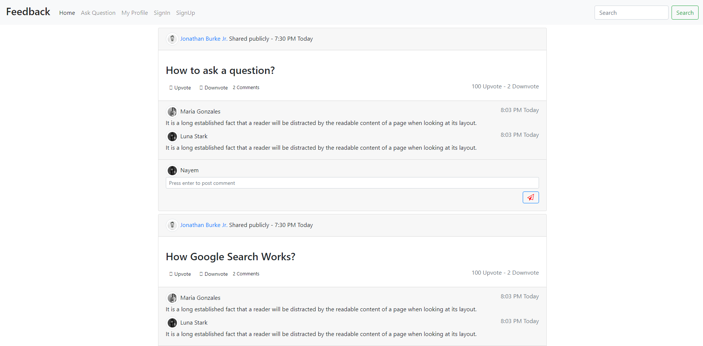
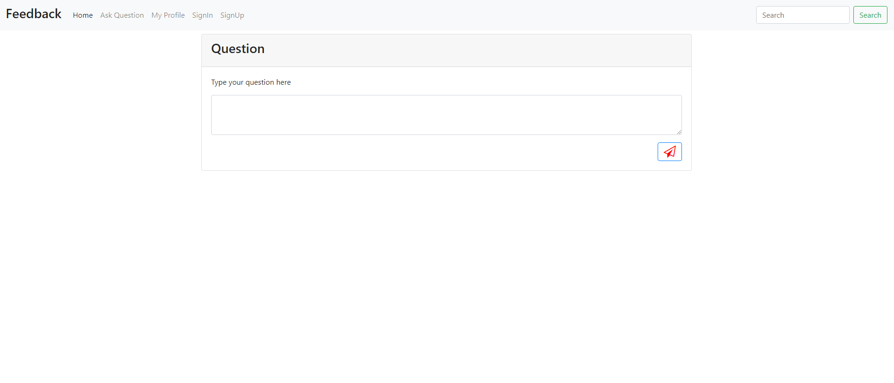
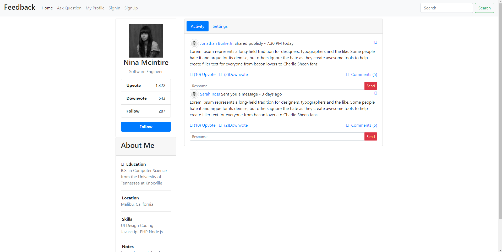
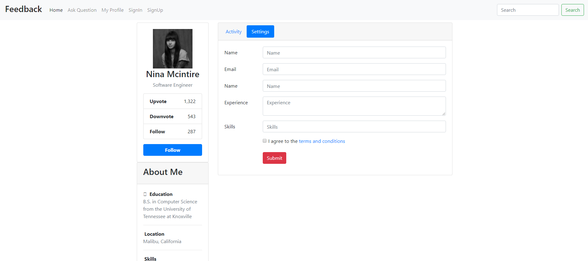
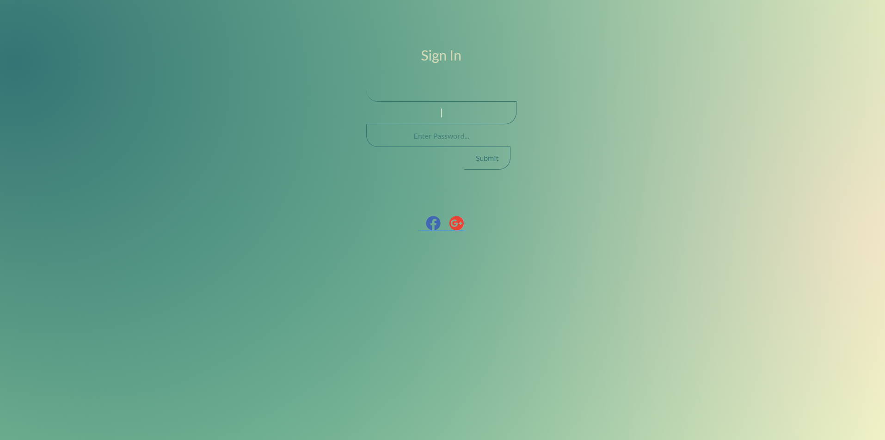
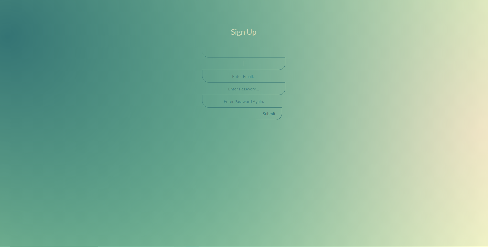

# FeedbackForum
Feedback Forum is a network of communities based on people's interests.This is Online only Q/A based web content rating, and discussion website. Registered members submit content to the site such as links, text posts,  which are then voted up or down and answered by other members. 

Demo URL : https://nayembinsayed.github.io/FeedbackForum/index.html

# Feature
1. SignIn/SignUp
2. Post any Question
3. Contents/Question are Voted Up/Down or answerd by other memebers
4. Follow each other ased on people's interests
5. Update Profile & About

# Home
screenshot

# Ask Question

# My profile

# Login

# SignUp

